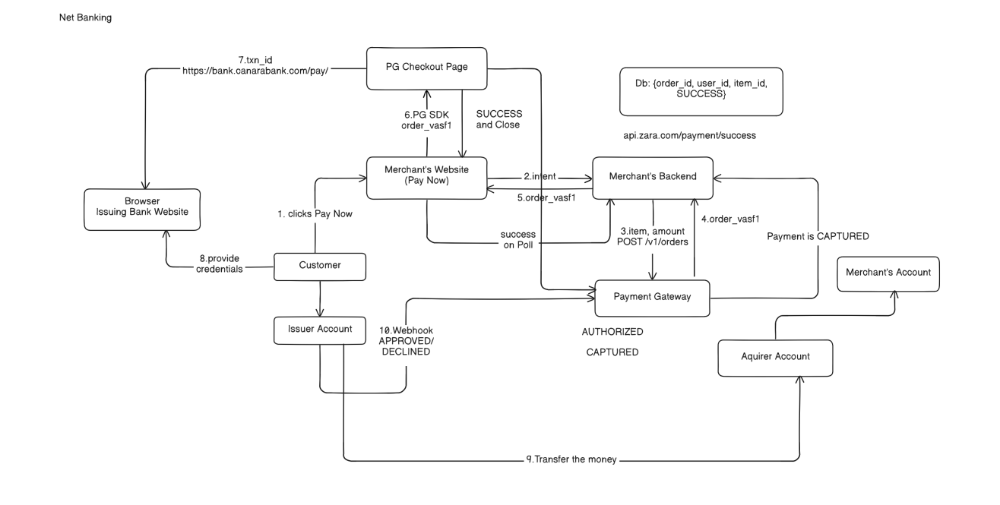
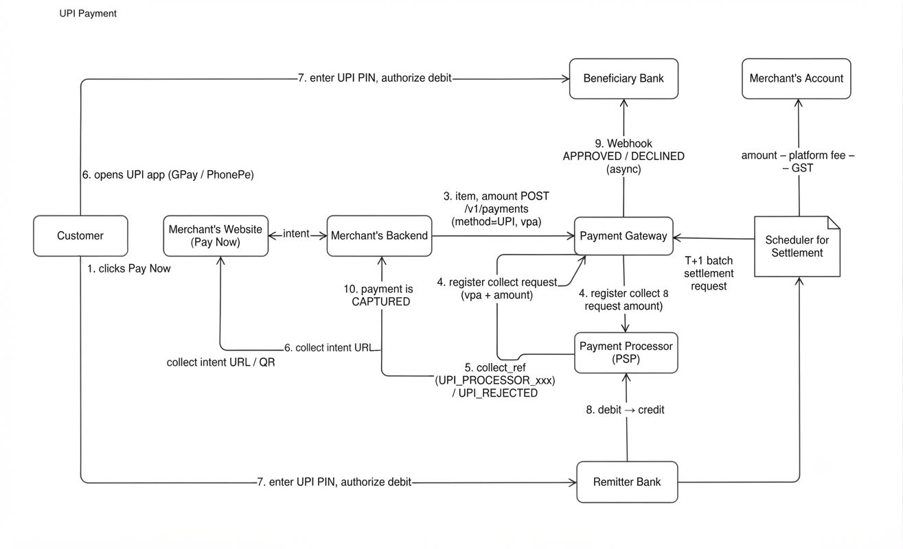
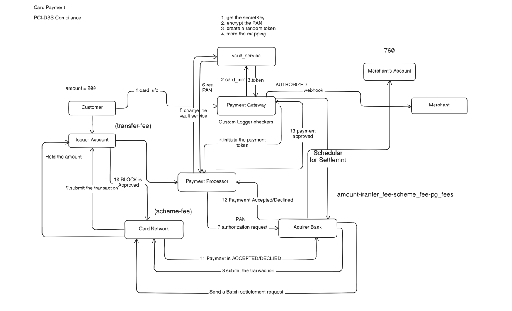
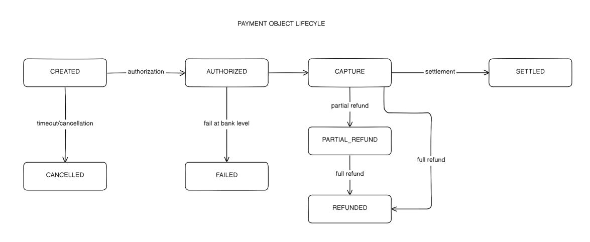
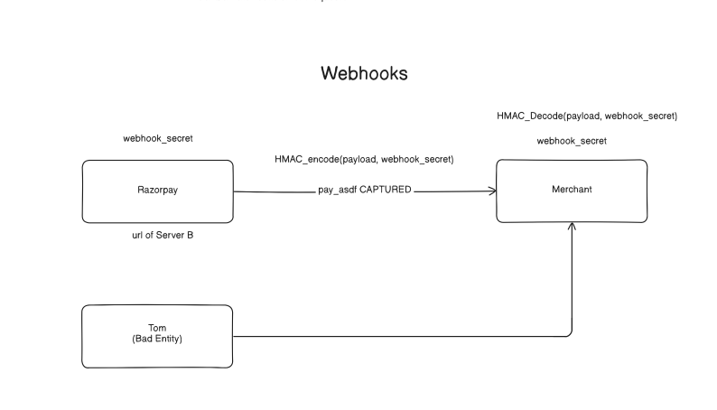
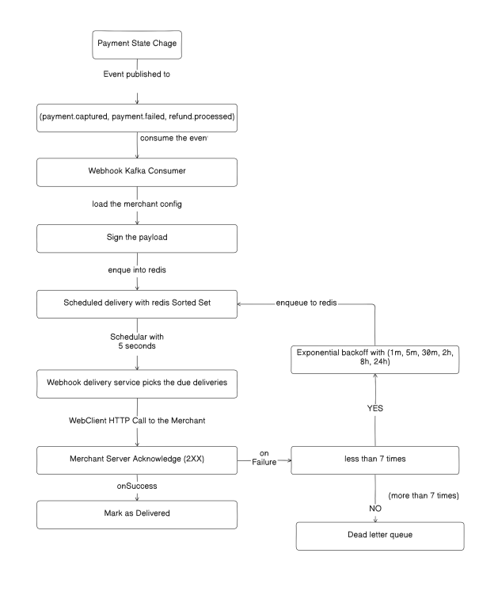
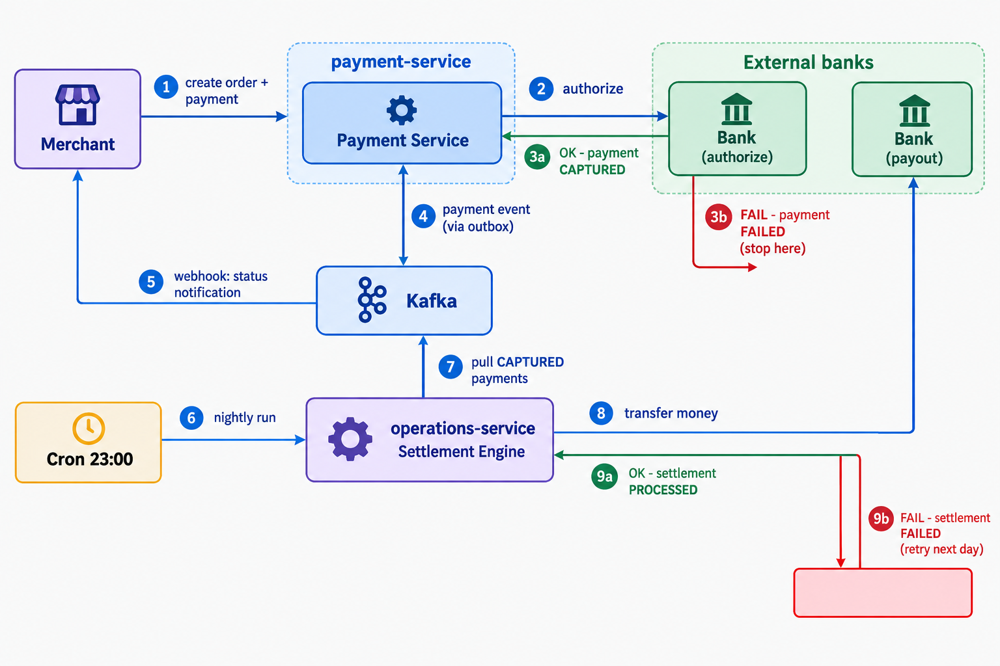

# PayGrid — Distributed Payment Gateway

PayGrid is a Razorpay-style payment gateway built with Spring Cloud microservices. Merchants sign up, log in, create scoped API keys, and accept payments through a single gateway API with idempotency, rate limiting, and PCI-safe card tokenization built in.

The payment flow is **correct, idempotent, and distributed** — order → payment → async bank resolution → settlement → webhook delivery — using the same consistency patterns (transactional outbox, distributed locking, idempotency keys) that production fintech systems depend on.

PayGrid is **actually deployed on Kubernetes**: six services and three stateful data stores, all defined as real `Deployment`, `StatefulSet`, `Service`, `ConfigMap`, and `Secret` manifests that have been applied, restarted, scaled, and debugged against a live cluster. Moving to a hosted cloud changes which managed services back the stateful components — not whether the platform is deployed.

An **observability stack is fully wired in**: Prometheus scrapes every service, a custom Grafana dashboard tracks per-service CPU and memory, and Zipkin traces requests end to end.

## Contents

- [Architecture](#architecture)
  - [Schema](#schema)
- [How it works](#how-it-works)
  - [Netbanking](#netbanking)
  - [UPI payment](#upi-payment)
  - [Card Payment](#card-payment)
  - [Payment object lifecycle](#payment-object-lifecycle)
- [Webhooks](#webhooks)
  - [Securing webhooks](#securing-webhooks)
  - [Retry mechanism and storing failed webhooks](#retry-mechanism-and-storing-failed-webhooks)
- [Design patterns involved](#design-patterns-involved)
  - [Transactional Outbox pattern](#transactional-outbox-pattern)
  - [Saga pattern](#saga-pattern)
  - [Strategy design pattern](#strategy-design-pattern)
- [Tech Stack](#tech-stack)
- [Run Locally](#run-locally)
  - [Script commands](#script-commands)
  - [What the script does](#what-the-script-does)
  - [Accessing the other services](#accessing-the-other-services)

## Architecture

A distributed, Kubernetes-native payment platform — order creation, payment authorization, bank callback simulation, settlement, and webhooks — built across seven microservices using the architectural patterns that Stripe, Razorpay, and Adyen rely on in production.

| Service | Responsibility |
| --- | --- |
| `api-gateway` | Auth (API key + BCrypt), rate limiting, routing |
| `payment-service` | Orders, payments, state machine, bank callback simulation |
| `merchant-service` | Merchant accounts, API keys, customers, webhooks |
| `operations-service` | Settlements, webhook delivery, outbox relay |
| `vault-service` | Card tokenization, encryption |
| `config-service` | Centralized config (Spring Cloud Config, git-backed) |
| `discovery-service` | Service registry (built, not deployed in the local Kind cluster) |

State lives in per-service PostgreSQL databases, Redis (rate limiting, idempotency, caching, distributed locks), and Kafka (event bus), all running as a real Kubernetes deployment of Deployments, StatefulSets, Services, ConfigMaps, and Secrets.

### Schema


## How it works

### Netbanking



The net banking payment flow begins when the customer clicks "Pay Now" on the merchant's website, which triggers an order creation request through the merchant's backend to the payment gateway. Once the order reference is generated, the payment gateway redirects the customer to their bank's checkout page, where they provide their credentials to authenticate the transaction. Finally, the issuing bank processes the money transfer to the acquirer account and sends a webhook to the payment gateway to approve the payment, updating the merchant's account and database.

### UPI payment



The UPI payment flow begins when the customer clicks "Pay Now" on the merchant's website, sending an intent to the merchant's backend, which then registers a payment request with the payment gateway. The payment gateway interacts with the payment processor to generate a collect reference, returning a collect intent URL or QR code to the website for the customer. The customer then opens a UPI app such as Google Pay or PhonePe and enters their UPI PIN to authorize the debit through the remitter bank, which routes the transaction via the UPI rail to the beneficiary bank. Finally, the beneficiary bank sends an asynchronous webhook to the payment gateway confirming approval or decline, updating the merchant's backend and triggering a T+1 batch settlement request from the settlement scheduler to credit the merchant's account minus platform fees and GST.

### Card Payment



The card payment flow begins when the customer provides their card information. The payment gateway sends this to the vault service, which encrypts the primary account number (PAN), creates a random token, and stores the mapping. Once the token is returned and tokenization is initiated with the payment processor, an authorization request containing the PAN is sent to the acquirer bank and routed through the card network to the issuer. The issuer holds the funds and responds with an approval or a decline, which travels back through the network and processor. The payment gateway then receives the approval webhook, informs the merchant, and a scheduler settles the funds, minus applicable fees, into the merchant's account. To keep this compliant, every step that processes, stores, or transmits cardholder data runs inside the tokenized vault boundary, so no PAN is persisted outside it and the platform stays within PCI-DSS scope.

### Payment object lifecycle



Transitions are enforced by the payment state machine, so an invalid jump throws instead of silently corrupting state.

| State | Meaning | Transitions to |
| --- | --- | --- |
| `CREATED` | Payment record created, no bank call made yet | `AUTHORIZING`, `CANCELLED` |
| `AUTHORIZING` | Collect request sent, awaiting the asynchronous bank response | `AUTHORIZED`, `FAILED`, `CANCELLED` |
| `AUTHORIZED` | Bank approved; funds reserved but not yet captured | `CAPTURING`, `AUTH_EXPIRED` |
| `CAPTURING` | Capture request in flight | `CAPTURED`, or back to `AUTHORIZED` if capture fails |
| `CAPTURED` | Funds captured; now eligible for settlement or refund | `SETTLED`, `PARTIALLY_REFUNDED`, `REFUNDED` |
| `PARTIALLY_REFUNDED` | Part of the captured amount returned to the customer | `REFUNDED` |
| `REFUNDED` | Fully refunded | terminal |
| `SETTLED` | Included in a merchant settlement batch | `PARTIALLY_REFUNDED` |
| `AUTH_EXPIRED` | Authorization window elapsed before capture | terminal |
| `CANCELLED` | Order or payment cancelled | terminal |
| `FAILED` | Terminal failure, typically a bank decline | terminal |

## Webhooks

### Securing webhooks



The webhook flow begins when PayGrid encodes a payment status payload such as `payment.captured` using the merchant's `webhook_secret`, signing it with `HMAC-SHA256` and transmitting it to the merchant's server URL. On receiving the notification, the merchant verifies authenticity and integrity by recomputing the signature over the same payload with the shared secret and comparing it in constant time. This cryptographic validation proves the message originated from PayGrid and protects the merchant's system from unauthorized or forged requests.

The signature travels in the `X-PayGrid-Signature` header, and webhook secrets are encrypted at rest rather than stored in plain text.

### Retry mechanism and storing failed webhooks



The webhook delivery and retry pipeline begins when a payment state change event such as `payment.captured`, `payment.failed`, or `refund.processed` is published and consumed by the webhook Kafka consumer. The consumer loads the merchant configuration, signs the payload, and enqueues it into a Redis sorted set for scheduled delivery. A webhook delivery service then makes the HTTP call to the merchant's server. A 2XX response marks the event as `DELIVERED`. If delivery fails and the attempt count is below seven, the event is scheduled for retry using a fixed backoff ladder (1m, 5m, 30m, 2h, 8h, 24h) and re-enqueued into Redis. Once the attempts are exhausted, the event is permanently moved to a dead-letter queue so it can be inspected and replayed instead of retried forever.

## Design patterns involved

| Pattern | Where | What breaks without it, at scale |
| --- | --- | --- |
| **Idempotency keys** | `X-Idempotency-Key` header, Redis-backed `IdempotencyFilter` | Retries are constant at scale (timeouts, LB failover, network blips) —<br>without this, retries create duplicate orders and charges |
| **Distributed scheduler locking** | `ShedLock` on `OutboxPoller`, `BankCallbackSimulator` | The moment you run more than one replica of any `@Scheduled` job,<br>every replica double-processes the same work |
| **Transactional outbox** | Outbox table + poller, atomic with the business write | “Write to DB” and “publish to Kafka” cannot both be guaranteed under partial failure without this —<br>a real distributed-systems bug, not an edge case |
| **Stateless services** | Every service — DB and Redis hold all state, never memory | The actual precondition for horizontal scaling. If two consecutive requests needed the same pod,<br>you could not add replicas at all |
| **Rate limiting** | Redis-backed, per-API-key (token bucket, sliding window, and fixed window all implemented) | Protects the system from a single bad client; without it, one misbehaving integration takes everyone down |
| **Circuit breaker + retry** | Resilience4j around the `payment-service` and `merchant-service` Feign clients | More scale means more failure surface. This is what stops one slow dependency from cascading into a full outage |
| **Saga (orchestration + choreography)** | `saga/PaymentAuthorizationRecorder`, `PaymentServiceImpl`, `SettlementTransactionExecutor`, `WebhookKafkaConsumer` | A payment spans the payment and order databases, the bank or gateway, the settlement database, and webhooks —<br>no single database transaction can cover them; without compensating steps, a partial failure leaves money in an inconsistent state |
| **Full observability** | Prometheus + Grafana (per-service CPU and memory), Zipkin tracing | You cannot capacity-plan — or debug — a system at scale you cannot see into |

### Transactional Outbox pattern


The Transactional Outbox pattern provides reliable communication between the Payment Service and the Operations Service.

When a payment changes, the Payment Service must do two things:

1. Update the payment in PostgreSQL.
2. Publish a payment event to Kafka for the Operations Service.

Doing both directly creates a risk of inconsistency:

```text
Payment DB update → Kafka publish
```

The Payment Service may successfully update the payment status to `SUCCESS` in PostgreSQL while the Kafka publish fails. The Payment Service then reports `SUCCESS`, but the Operations Service never receives the event.

To solve this, the payment update and the event write happen in one transaction:

```text
Payment Service
→ DB transaction
→ Update payment
→ Insert event into outbox table
→ COMMIT
```

Then, separately:

```text
Outbox table → Kafka → Operations Service
```

Because the payment update and the outbox insert share a single database transaction, a committed payment update always has its corresponding event stored in the outbox table. A separate publisher reads pending outbox events and publishes them to Kafka.

This avoids a distributed transaction between PostgreSQL and Kafka while guaranteeing reliable event delivery between the two services.

### Saga pattern



The end-to-end payment flow is a Saga: one distributed transaction broken into local transactions with compensating actions instead of two-phase commit or distributed rollback.

Each step owns a different database (the payment-service and operations-service PostgreSQL instances) plus external systems (the bank or gateway, the merchant webhook endpoint), with Kafka in between. No single ACID transaction can span them. If the gateway declines after the order was marked `ATTEMPTED`, or the bank transfer fails after the settlement row was created, the Saga compensates rather than rolling back.

PayGrid combines both flavors — orchestration inside a service, choreography across services:

1. **Orchestrated authorization saga in `payment-service`** — forward steps record the payment and call the gateway; a failure runs the compensating step that moves the payment to `FAILED` and emits `PAYMENT_AUTHORIZATION_COMPENSATED`.
2. **Choreographed settlement and webhook saga via the outbox and Kafka** — each service reacts to published events, and failures land in an explicit `FAILED` state instead of a partially applied change.

The rule of thumb is:

> One business transaction spanning multiple services and databases, with no 2PC available, means a Saga of local transactions and compensating states.

There is no distributed rollback in PayGrid: every forward step has a defined compensation (`AUTHORIZE_FAIL`, settlement `FAILED`, webhook retry and dead-letter queue), and the outbox guarantees that every Saga event eventually reaches the next participant.

### Strategy design pattern


UPI, NetBanking, and Card payments are a natural fit for the Strategy pattern: each performs the same high-level operation — processing a payment — with a different implementation per method.

- Payment Strategy
  - Card Payment Strategy
  - UPI Payment Strategy
  - NetBanking Payment Strategy

The Payment Service only knows that it must process a payment; it does not know how Card, UPI, or NetBanking works internally.

- Card requires card validation, authorization, and 3-D Secure.
- UPI requires VPA or intent handling, PSP communication, and asynchronous callbacks.
- NetBanking requires bank selection, redirection, authentication, and bank callbacks.

Without Strategy, this becomes a large `if-else` or `switch` block:

```text
if CARD → card logic
else if UPI → UPI logic
else if NET_BANKING → net banking logic
```

As more payment methods are added, this grows harder to maintain and test.

With Strategy, each payment method has its own class with its specific processing logic. Adding a method such as Wallet or EMI means adding another strategy instead of expanding the existing payment-processing code.

The rule of thumb is:

> Same business operation plus different algorithms or implementations means Strategy pattern.

In PayGrid, this also isolates external integrations: each strategy talks to its own payment processor, PSP, or bank without the core `PaymentService` knowing those details.

## Tech Stack

You do not need any of this installed to test the project — prebuilt images are pulled automatically. The stack is listed for reference.

- **Java 25**
- **Spring Boot 4.1**
- **Spring Cloud:** Gateway, Config Server, Eureka
- **Database:** PostgreSQL + Hibernate (`ddl-auto`)
- **Caching:** Redis
- **Messaging:** Apache Kafka (KRaft)
- **Security:** JJWT + BCrypt
- **Mapping:** MapStruct
- **Distributed Scheduling:** ShedLock
- **Resilience:** Resilience4j
- **Observability:** Prometheus + Grafana + Zipkin
- **Local Development:** Kind + Spring Cloud Config Server
- **Kubernetes:** Kind + Kustomize
- **Containerization:** Docker + Jib

## Run Locally

The whole platform runs in a single local Kubernetes cluster (Kind): all six application services plus Postgres, Redis, Kafka, Zipkin, Prometheus, Grafana, and Kafka UI.

**Prerequisites:** Docker, kind, `kubectl`, and `openssl`. Give Docker at least 10 GB of memory and make sure host port `8080` is free.

### 1. Clone the project

```bash
git clone https://github.com/saspal02/Paygrid.git
```

### 2. Go to the project directory

```bash
cd Paygrid
```

### 3. Run the project

```bash
./scripts/run-local.sh
```

The script creates your secrets file if missing, creates the Kind cluster, deploys everything, and waits until all pods are ready. The first start takes 5–10 minutes, most of it pulling images and waiting for the services to settle.

### 4. Open the API

```text
http://localhost:8080/swagger-ui.html
```

### 5. Stop the project

```bash
./scripts/run-local.sh down
```

### Script commands

| Command | Description |
| --- | --- |
| `./scripts/run-local.sh` | Create the cluster and deploy (same as `up`) |
| `./scripts/run-local.sh up` | Create the cluster and deploy |
| `./scripts/run-local.sh down` | Delete the cluster |
| `./scripts/run-local.sh fresh` | Delete the cluster and redeploy from scratch |
| `./scripts/run-local.sh status` | Show all pods and services |
| `./scripts/run-local.sh logs [pod]` | Follow the logs of a pod (all pods if omitted) |
| `./scripts/run-local.sh pf` | Port-forward Grafana, Prometheus, Zipkin, and Kafka UI |
| `./scripts/run-local.sh secrets` | Regenerate `k8s/k8s-secrets.env` |
| `./scripts/run-local.sh up --timeout N` | Wait up to N seconds for the pods (default 600) |

### What the script does

```bash
cp k8s/k8s-secrets.env.example k8s/k8s-secrets.env
kind create cluster --config k8s/kind-config.yaml
kubectl apply -k k8s/
kubectl -n paygrid-core wait --for=condition=Ready pod --all --timeout=600s
```

To stop:

```bash
kind delete cluster
```

### Accessing the other services

Only the API gateway is exposed to the host. Everything else is reachable through port-forwarding:

```bash
kubectl -n paygrid-core port-forward svc/grafana        3000:3000   # Grafana (admin / the GRAFANA_ADMIN_PASSWORD you set)
kubectl -n paygrid-core port-forward svc/prometheus     9090:9090   # Prometheus
kubectl -n paygrid-core port-forward svc/zipkin         9411:9411   # Zipkin
kubectl -n paygrid-core port-forward svc/kafka-ui       8090:8090   # Kafka UI
kubectl -n paygrid-core port-forward svc/postgres       5432:5432   # Postgres
kubectl -n paygrid-core port-forward svc/redis          6379:6379   # Redis
kubectl -n paygrid-core port-forward svc/kafka          9092:9092   # Kafka
kubectl -n paygrid-core port-forward svc/config-service 8888:8888   # Config server
```

Or run all four observability UIs at once with `./scripts/run-local.sh pf`.
