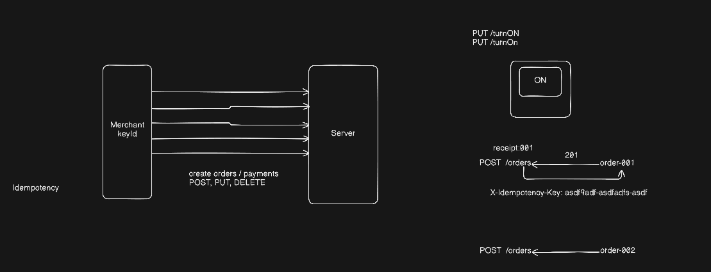
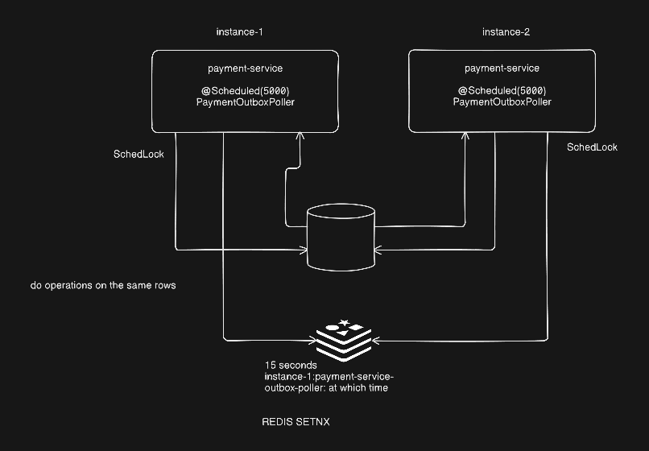

# PayGrid — Distributed Payment Gateway (like Razorpay)

PayGrid is a Razorpay-style payment gateway built with Spring Cloud microservices. Merchants sign up, log in, create scoped API keys, and accept payments through a single gateway API with idempotency, rate limiting, and PCI-safe card tokenization built in.

The payment flow is **correct, idempotent, and distributed** — order → payment → async bank resolution → settlement → webhook delivery — using the same consistency patterns (transactional outbox, distributed locking, idempotency keys) that production fintech systems depend on.

PayGrid is **actually deployed on Kubernetes**: six services and three stateful data stores, all defined as real `Deployment`, `StatefulSet`, `Service`, `ConfigMap`, and `Secret` manifests that have been applied, restarted, scaled, and debugged against a live cluster. Moving to a hosted cloud changes which managed services back the stateful components — not whether the platform is deployed.

An **observability stack is fully wired in**: Prometheus scrapes every service, a custom Grafana dashboard tracks per-service CPU and memory, and Zipkin traces requests end to end.

This is the super layman flow of payments from gateway by the customer to merchant and to bank for settlement.


## Contents

- [Architecture](#architecture)
  - [Schema](#schema)
- [How it works](#how-it-works)
  - [Netbanking](#netbanking)
  - [UPI payment](#upi-payment)
  - [Card payment](#card-payment)
  - [Payment object lifecycle](#payment-object-lifecycle)
- [Webhooks](#webhooks)
  - [Securing webhooks](#securing-webhooks)
  - [Retry and dead letter queue](#retry-and-dead-letter-queue)
- [Design patterns involved](#design-patterns-involved)
  - [Idempotency keys](#idempotency-keys-or-idempotent-transactions)
  - [Distributed scheduler locking](#distributed-scheduler-locking)
  - [Transactional Outbox pattern](#transactional-outbox-pattern)
  - [Stateless service](#stateless-service)
  - [Rate limiting](#rate-limiting)
  - [Circuit breakers](#circuit-breakers)
  - [Saga pattern](#saga-pattern)
  - [API key rotation](#api-key-rotation)
- [Tech Stack](#tech-stack)
- [Run Locally](#run-locally)
  - [Script commands](#script-commands)
  - [What the script does](#what-the-script-does)
  - [Accessing the other services](#accessing-the-other-services)
- [Load testing](#load-testing)
  - [Infrastructure cost at 10,000 TPS](#infrastructure-cost-at-10000-tps)
  - [JMeter test results](#jmeter-test-results)

---

## Architecture


A distributed, Kubernetes-native payment platform — order creation, payment authorization, bank callback simulation, settlement, and webhooks — built across seven microservices using the architectural patterns that Stripe, Razorpay, and Adyen rely on in production.

| Service | Responsibility |
|---|---|
| `api-gateway` | Auth (API key + BCrypt), rate limiting, routing |
| `payment-service` | Orders, payments, state machine, bank callback simulation |
| `merchant-service` | Merchant accounts, API keys, customers, webhooks |
| `operations-service` | Settlements, webhook delivery, outbox relay |
| `vault-service` | Card tokenization, encryption |
| `config-service` | Centralized config (Spring Cloud Config, git-backed) |
| `discovery-service` | Service registry (built, not deployed in the local Kind cluster) |

State lives in per-service PostgreSQL databases, Redis (rate limiting, idempotency, caching, distributed locks), and Kafka (event bus), all running as a real Kubernetes deployment of Deployments, StatefulSets, Services, ConfigMaps, and Secrets.

### Schema


---

## How it works


UPI, NetBanking, and Card payments are a natural fit for the Strategy pattern: each performs the same high-level operation — processing a payment — with a different implementation per method.

- **Payment Strategy**
  - Card Payment Strategy
  - UPI Payment Strategy
  - NetBanking Payment Strategy

The Payment Service only knows that it must process a payment; it does not know how Card, UPI, or NetBanking works internally.

- Card requires card validation, authorization, and 3-D Secure.
- UPI requires VPA or intent handling, PSP communication, and asynchronous callbacks.
- NetBanking requires bank selection, redirection, authentication, and bank callbacks.

### Netbanking


1. Customer selects NetBanking and chooses their bank.
2. Gateway redirects to bank's checkout page.
3. Customer authenticates with bank credentials.
4. Bank processes the transfer to the acquirer account.
5. Bank sends async webhook to gateway confirming the payment.
6. Merchant account is updated.

### UPI payment


1. Customer initiates UPI payment.
2. `UpiPaymentProcessor` generates a collect reference.
3. Customer receives a QR code or intent URL.
4. Customer authorizes via UPI app (Google Pay, PhonePe, etc.) with UPI PIN.
5. Remitter bank routes through UPI rail to beneficiary bank.
6. Async webhook confirms approval or decline.
7. T+1 settlement credits merchant account minus fees.

### Card Payment


1. Customer submits card details.
2. Gateway routes to Vault Service for tokenization (AES-256-GCM encryption).
3. Vault returns a token; PAN is never stored outside the vault boundary.
4. `CardPaymentProcessor` validates the card and initiates authorization.
5. Bank responds with approval or decline.
6. On approval, funds are reserved (`AUTHORIZED` state).
7. Capture moves funds to `CAPTURED` state.
8. Settlement batch transfers funds to merchant.

> **PCI-DSS Compliance:** All cardholder data processing occurs within the vault service boundary. No PAN is persisted outside the encrypted vault store.

### Payment object lifecycle


Every payment follows a strict state machine. Invalid transitions throw `InvalidStateTransitionException` instead of silently corrupting state.

| State | Meaning | Transitions to |
|---|---|---|
| `CREATED` | Payment record created, no bank call made yet | `AUTHORIZING`, `CANCELLED` |
| `AUTHORIZING` | Collect request sent, awaiting the asynchronous bank response | `AUTHORIZED`, `FAILED`, `CANCELLED` |
| `AUTHORIZED` | Bank approved; funds reserved but not yet captured | `CAPTURING`, `AUTH_EXPIRED` |
| `CAPTURING` | Capture request in flight | `CAPTURED`, or back to `AUTHORIZED` if capture fails |
| `CAPTURED` | Funds captured; now eligible for settlement or refund | `SETTLED`, `PARTIALLY_REFUNDED`, `REFUNDED` |
| `PARTIALLY_REFUNDED` | Part of the captured amount returned to the customer | `REFUNDED` |
| `REFUNDED` | Fully refunded | Terminal |
| `SETTLED` | Included in a merchant settlement batch | `PARTIALLY_REFUNDED` |
| `AUTH_EXPIRED` | Authorization window elapsed before capture | Terminal |
| `CANCELLED` | Order or payment cancelled | Terminal |
| `FAILED` | Terminal failure, typically a bank decline | Terminal |


**Terminal States:**

- **FAILED** — Bank decline or processing error
- **CANCELLED** — User or system cancellation
- **REFUNDED** — Full refund completed
- **AUTH_EXPIRED** — Authorization window elapsed before capture

---

## Webhooks

### Securing webhooks


The webhook flow begins when PayGrid encodes a payment status payload such as `payment.captured` using the merchant's `webhook_secret`, signing it with `HMAC-SHA256` and transmitting it to the merchant's server URL. On receiving the notification, the merchant verifies authenticity and integrity by recomputing the signature over the same payload with the shared secret and comparing it in constant time. This cryptographic validation proves the message originated from PayGrid and protects the merchant's system from unauthorized or forged requests.

The signature travels in the `X-PayGrid-Signature` header, and webhook secrets are encrypted at rest rather than stored in plain text.

### Retry and dead letter queue


The webhook delivery and retry pipeline begins when a payment state change event such as `payment.captured`, `payment.failed`, or `refund.processed` is published and consumed by the webhook Kafka consumer. The consumer loads the merchant configuration, signs the payload, and enqueues it into a Redis sorted set for scheduled delivery. A webhook delivery service then makes the HTTP call to the merchant's server. A 2XX response marks the event as `DELIVERED`. If delivery fails and the attempt count is below seven, the event is scheduled for retry using a fixed backoff ladder (1m, 5m, 30m, 2h, 8h, 24h) and re-enqueued into Redis. Once the attempts are exhausted, the event is permanently moved to a dead-letter queue so it can be inspected and replayed instead of retried forever.

| Attempt | Backoff |
|---|---|
| 1 | Immediate |
| 2 | 1 minute |
| 3 | 5 minutes |
| 4 | 30 minutes |
| 5 | 2 hours |
| 6 | 8 hours |
| 7 | 24 hours |
| Failed | Moved to dead-letter queue for manual inspection and replay |

---

## Design patterns involved

| Pattern | Where | What breaks without it, at scale |
|---|---|---|
| **Idempotency keys** | `X-Idempotency-Key` header, Redis-backed `IdempotencyFilter` | Retries are constant at scale (timeouts, LB failover, network blips) — without this, retries create duplicate orders and charges |
| **Distributed scheduler locking** | `ShedLock` on `OutboxPoller`, `BankCallbackSimulator` | The moment you run more than one replica of any `@Scheduled` job, every replica double-processes the same work |
| **Transactional outbox** | Outbox table + poller, atomic with the business write | "Write to DB" and "publish to Kafka" cannot both be guaranteed under partial failure without this — a real distributed-systems bug, not an edge case |
| **Stateless services** | Every service — DB and Redis hold all state, never memory | The actual precondition for horizontal scaling. If two consecutive requests needed the same pod, you could not add replicas at all |
| **Rate limiting** | Redis-backed, per-API-key (token bucket, sliding window, and fixed window all implemented) | Protects the system from a single bad client; without it, one misbehaving integration takes everyone down |
| **Circuit breaker + retry** | Resilience4j around the `payment-service` and `merchant-service` Feign clients | More scale means more failure surface. This is what stops one slow dependency from cascading into a full outage |
| **Saga (orchestration + choreography)** | `saga/PaymentAuthorizationRecorder`, `PaymentServiceImpl`, `SettlementTransactionExecutor`, `WebhookKafkaConsumer` | A payment spans the payment and order databases, the bank or gateway, the settlement database, and webhooks — no single database transaction can cover them; without compensating steps, a partial failure leaves money in an inconsistent state |
| **Full observability** | Prometheus + Grafana (per-service CPU and memory), Zipkin tracing | You cannot capacity-plan — or debug — a system at scale you cannot see into |
| **API rotation** | API key rotation to replace an existing API key with a new key without breaking the client’s access | If the key is exposed, attacker can authenticate as the merchant |

### Idempotency keys or idempotent transactions



The `X-Idempotency-Key` header prevents duplicate charges from retries. Redis-backed `IdempotencyFilter` checks the key before processing — if already seen, returns the cached response immediately.

### Distributed scheduler locking



`ShedLock` ensures only one pod executes `@Scheduled` jobs at a time. Without it, every replica would double-process outbox events, bank callbacks, and settlement batches.

### Transactional Outbox pattern


The fundamental problem: updating a payment in PostgreSQL and publishing to Kafka cannot be a single atomic operation. Without the outbox pattern, a crash between these two steps causes lost events.

**PayGrid's solution:**

1. Payment update and outbox row insert share one DB transaction.
2. `OutboxPoller` (protected by ShedLock) reads pending outbox events.
3. Events are published to Kafka and marked as sent.
4. Both `payment-service` and `operations-service` implement this pattern independently.

### Stateless service


A stateless service can use Redis to store shared state externally instead of keeping it in the service's memory.
This allows any service instance to handle any request.

### Rate limiting


Three algorithms implemented in `common-lib`, all Redis-backed and per-API-key:

| Algorithm | Class | Use Case |
|---|---|---|
| Token Bucket | `TokenBucketRateLimiter` | Smooth burst allowance with steady refill |
| Sliding Window | `SlidingWindowRateLimiter` | Precise window-based limiting |
| Sliding Window (Lua) | `SlidingWindowLuaLimiter` | Atomic Redis Lua script for distributed accuracy |
| Fixed Window | `FixedWindowRateLimiter` | Simple counter reset at window boundary |

> For simplicity, we are using the **Fixed Window** algorithm.

### Circuit breakers


Resilience4j wraps Feign clients to `payment-service` and `merchant-service`. When a downstream service degrades, the circuit opens, failing fast instead of cascading timeouts.

### Saga pattern


A payment spans multiple databases and external systems. No single ACID transaction can cover the entire flow. PayGrid uses both orchestrated and choreographed sagas:

| Saga Type | Location | Forward Steps | Compensation |
|---|---|---|---|
| Authorization Saga | `payment-service` | Record payment → call payment gateway | Move to `FAILED`, emit `PAYMENT_AUTHORIZATION_COMPENSATED` |
| Settlement Saga | `operations-service` | Pull unsettled payments → transfer funds | Mark settlement `FAILED`, payments remain `CAPTURED` for next run |
| Webhook Saga | `operations-service` | Publish via outbox → deliver to merchant | 7-attempt retry with backoff → dead-letter queue |

### API key rotation


API key rotation allows merchants to securely replace compromised or expired API keys without disrupting active integrations. The entire flow is designed to prevent service interruption during the transition.

**Security considerations:**

- Disabled keys cannot be rotated — `rotate()` throws `RuntimeException` if the key is disabled.
- The raw secret is returned only once in the rotation response; subsequent calls return only the key ID.
- Secrets are never stored in plain text — only BCrypt hashes are persisted in PostgreSQL.
- The grace period provides a safety net: if a merchant loses the new secret before updating all integrations, the old secret still works within the window.

---

## Tech Stack

You do not need any of this installed to test the project — prebuilt images are pulled automatically. The stack is listed for reference.

- **Java 25**
- **Spring Boot 4.1**
- **Spring Cloud:** Gateway, Config Server, Eureka
- **Database:** PostgreSQL + Hibernate (`ddl-auto`)
- **Caching:** Redis
- **Messaging:** Apache Kafka (KRaft)
- **Security:** JJWT + BCrypt
- **Mapping:** MapStruct
- **Distributed Scheduling:** ShedLock
- **Resilience:** Resilience4j
- **Observability:** Prometheus + Grafana + Zipkin
- **Local Development:** Kind + Spring Cloud Config Server
- **Kubernetes:** Kind + Kustomize
- **Containerization:** Docker + Jib

---

## Run Locally

The whole platform runs in a single local Kubernetes cluster (Kind): all six application services plus Postgres, Redis, Kafka, Zipkin, Prometheus, Grafana, and Kafka UI.

> **Prerequisites:** Docker, `kind`, `kubectl`, and `openssl`. Give Docker at least 10 GB of memory and make sure host port `8080` is free.

### 1. Clone the project

```bash
git clone https://github.com/saspal02/Paygrid.git
```

### 2. Go to the project directory

```bash
cd Paygrid
```

### 3. Run the project

```bash
./scripts/run-local.sh
```

The script creates your secrets file if missing, creates the Kind cluster, deploys everything, and waits until all pods are ready. The first start takes 5–10 minutes, most of it pulling images and waiting for the services to settle.

### 4. Open the API

```text
http://localhost:8080/swagger-ui.html
```

### 5. Stop the project

```bash
./scripts/run-local.sh down
```

### Script commands

| Command | Description |
|---|---|
| `./scripts/run-local.sh` | Create the cluster and deploy (same as `up`) |
| `./scripts/run-local.sh up` | Create the cluster and deploy |
| `./scripts/run-local.sh down` | Delete the cluster |
| `./scripts/run-local.sh fresh` | Delete the cluster and redeploy from scratch |
| `./scripts/run-local.sh status` | Show all pods and services |
| `./scripts/run-local.sh logs [pod]` | Follow the logs of a pod (all pods if omitted) |
| `./scripts/run-local.sh pf` | Port-forward Grafana, Prometheus, Zipkin, and Kafka UI |
| `./scripts/run-local.sh secrets` | Regenerate `k8s/k8s-secrets.env` |
| `./scripts/run-local.sh up --timeout N` | Wait up to N seconds for the pods (default 600) |

### What the script does

```bash
cp k8s/k8s-secrets.env.example k8s/k8s-secrets.env
kind create cluster --config k8s/kind-config.yaml
kubectl apply -k k8s/
kubectl -n paygrid-core wait --for=condition=Ready pod --all --timeout=600s
```

To stop:

```bash
kind delete cluster
```

### Accessing the other services

Only the API gateway is exposed to the host. Everything else is reachable through port-forwarding:

```bash
kubectl -n paygrid-core port-forward svc/grafana        3000:3000   # Grafana (admin / the GRAFANA_ADMIN_PASSWORD you set)
kubectl -n paygrid-core port-forward svc/prometheus     9090:9090   # Prometheus
kubectl -n paygrid-core port-forward svc/zipkin         9411:9411   # Zipkin
kubectl -n paygrid-core port-forward svc/kafka-ui       8090:8090   # Kafka UI
kubectl -n paygrid-core port-forward svc/postgres       5432:5432   # Postgres
kubectl -n paygrid-core port-forward svc/redis          6379:6379   # Redis
kubectl -n paygrid-core port-forward svc/kafka          9092:9092   # Kafka
kubectl -n paygrid-core port-forward svc/config-service 8888:8888   # Config server
```

Or run all four observability UIs at once with `./scripts/run-local.sh pf`.

---

## Load testing

### Infrastructure cost at 10,000 TPS

10,000 transactions/sec = ~20,000 HTTP requests/sec (`Create Order` + `Init Payment` per transaction).

| Component | Instance type | Count | Est. $/month |
|---|---|---|---|
| `api-gateway` | `c6i.xlarge` (4 vCPU / 8 GB) | 30 | ~$2,200 |
| `payment-service` | `m6i.xlarge` (4 vCPU / 16 GB) | 50 | ~$4,400 |
| `merchant-service` | `m6i.large` (2 vCPU / 8 GB) | 15 | ~$650 |
| `vault-service` | `m6i.large` (2 vCPU / 8 GB) | 15 | ~$650 |
| `operations-service` | `m6i.large` (2 vCPU / 8 GB) | 8 | ~$350 |
| PgBouncer (connection pooling) | `m6i.large` | 4 | ~$180 |
| Postgres (sharded, 4 shards, writer+reader each) | `db.r6g.2xlarge` | 8 | ~$7,000 |
| Redis Cluster | `cache.r6g.large`, 3 shards | 3 | ~$800 |
| Kafka (MSK) | `kafka.m5.large`, 3 brokers | 3 | ~$600 |
| **Total (compute only)** | | **~136 instances** | **~$16,830/month** |

> Realistic all-in cost (adding load balancers, cross-AZ transfer, storage/IO, control plane, observability, backups): **~$25,000–35,000/month**.

We can easily scale up to 10,000 transactions per second if we increase our infrastructure. The way the system is designed, it can handle huge transaction volumes as well.

### JMeter test results


